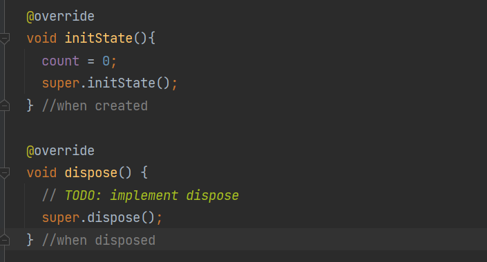
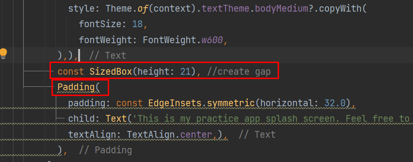
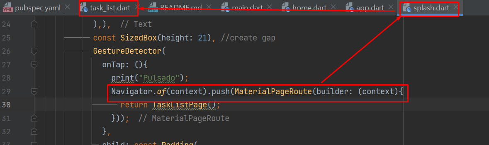
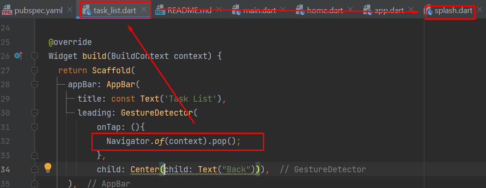
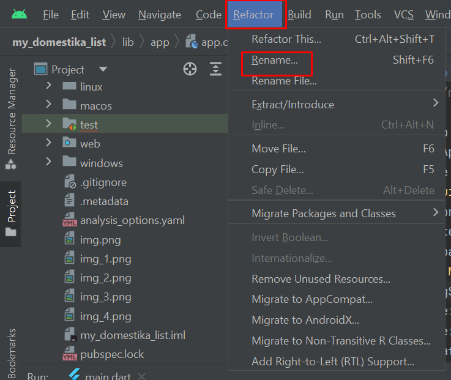
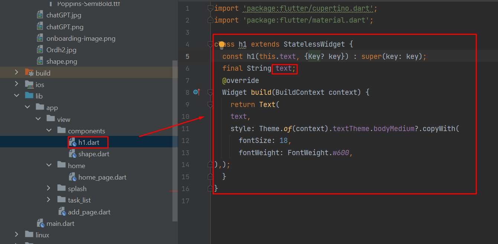
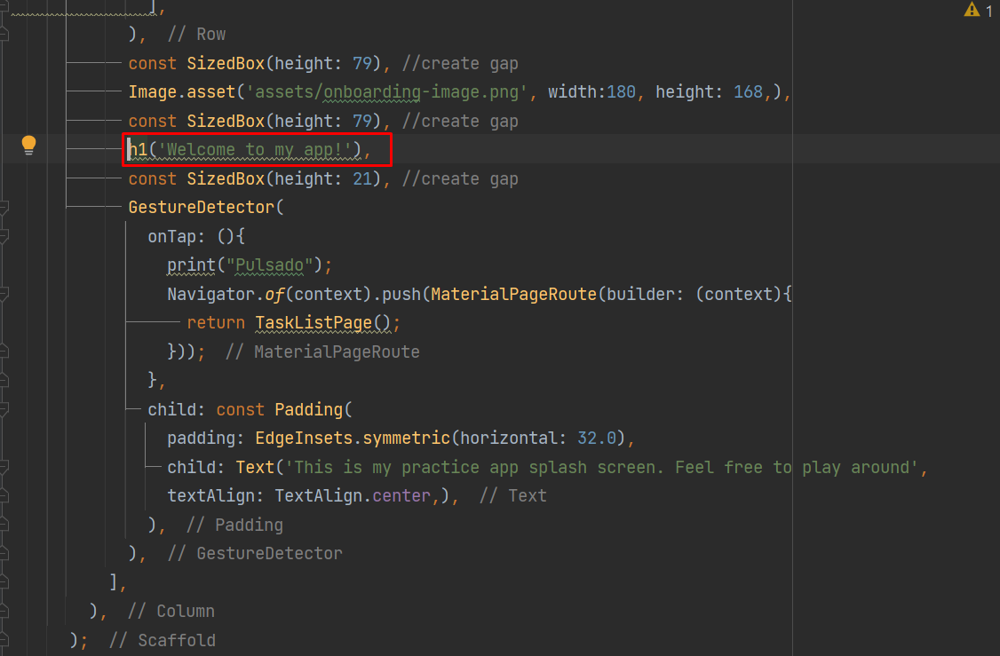
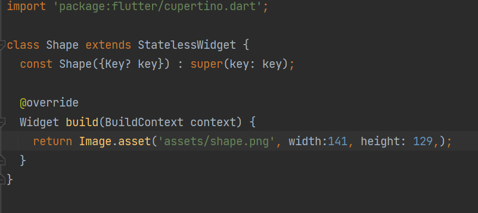
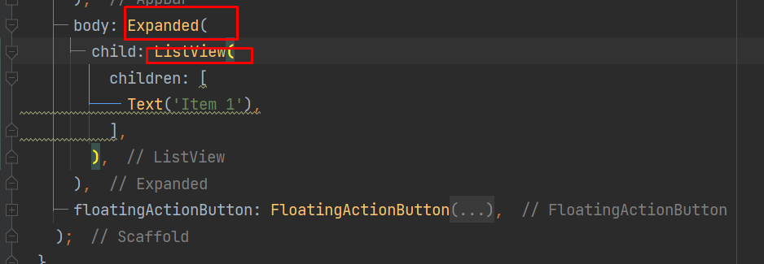
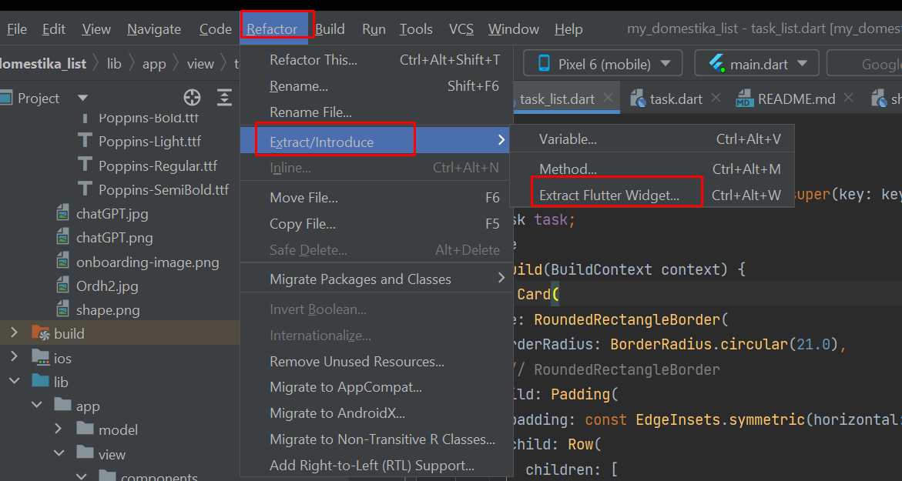

An application built while taking Jose Manuel Marquez's Flutter course as an effort to further develop comfySSH

1. Universal theming

2. Init & Dispose

These are the 2 functions working when a new class is initialized & disposed of. My plan is to use this to optimize by data saving operation for comfySSH App.
3. Stateful widget
This will help the "Card" creation and information storing in each app session much faster than having to constantly save to & fetch from memory.
4. Layout with sizedbox & padding

5. Moving between pages (cleaner than my previous implementation)

6. This allows for default "back" button too

7. Refactoring for clean code

Note to self: Flutter & Android Studio just refactors so nicely
8. Reusable components

First create a dart file as components

And use it like a widget with properties

Also, an example of a custom component without property needed (shape, icon, etc.)
9. Extended + ListView = proper list scrolling

10. Extract a freakin' widget

This way you can clean up & organize your code. Just another reason to love Flutter & Android Studio